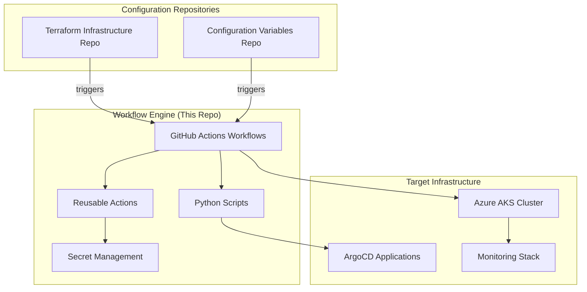
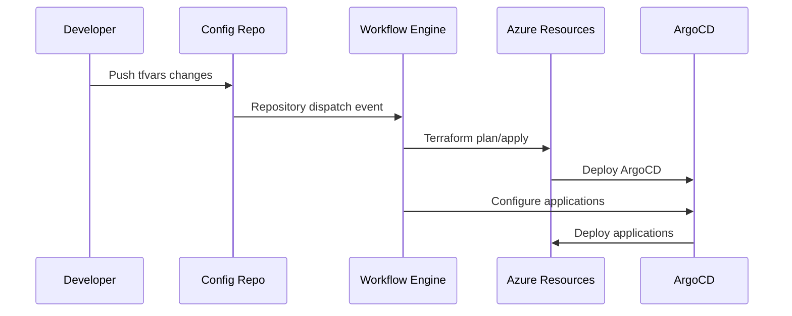

# Azure Terraform Workflows - GitOps CI/CD Engine

This repository serves as the **central CI/CD automation engine** for GitOps-driven infrastructure and application deployments. It provides reusable GitHub Actions, workflows, and tools that orchestrate Terraform infrastructure provisioning and ArgoCD application deployments across multiple environments and repositories.

## 🎯 Repository Purpose

This **terraform-workflows** repository acts as the automation hub that:

- **Processes infrastructure changes** from Terraform configuration repositories
- **Manages application deployments** through ArgoCD configurations
- **Provides reusable GitHub Actions** for common DevOps operations
- **Orchestrates multi-environment deployments** with proper approvals and gates
- **Integrates secrets management** with Azure Key Vault and GitHub Secrets
- **Supports both manual and event-driven** deployment workflows

## 🏗️ Architecture Overview



## 📁 Repository Structure

```
.
├── .github/
│   ├── actions/                     # Reusable GitHub Actions
│   │   ├── dynamic-inbound-rule/    # AWS security group management
│   │   ├── setup-argocd-cli/        # ArgoCD CLI installation
│   │   ├── terraform-auth/          # Azure authentication
│   │   ├── terraform-common/        # Common Terraform routines
│   │   └── terraform-vars-parse/    # Variable parsing utilities
│   └── workflows/                   # GitHub Actions workflows
│       ├── argocd-run-service.yml   # Reusable ArgoCD service workflow
│       ├── argocd.yml               # Main ArgoCD deployment workflow
│       └── tf_plan_apply_azure.yml  # Terraform infrastructure workflow
├── scripts/                         # Python automation scripts
│   ├── argocd-application.py        # ArgoCD application management
│   ├── argocd-project.py            # ArgoCD project management
│   ├── argocd-repository.py         # ArgoCD repository management
│   ├── grafana-setup.py             # Grafana configuration
│   └── utils.py                     # Utility functions & Azure Key Vault
├── requirements.txt                 # Python dependencies
└── README.md                        # This documentation
```

## 🚀 Core Features

### **Event-Driven Automation**
- **Repository dispatch events** from configuration changes
- **Manual workflow triggers** for controlled deployments
- **Pull request integration** with plan previews and cost analysis
- **Environment-specific deployment gates** and approvals

### **Multi-Cloud Infrastructure Support**
- **Azure focus** with comprehensive AKS support
- **AWS integration** for hybrid cloud scenarios
- **Terraform state management** with multiple backend options
- **Cross-cloud networking** and security configurations

### **GitOps Application Management**
- **ArgoCD integration** for Kubernetes application lifecycle
- **Helm chart templating** with dynamic value injection
- **Application dependency management** and deployment ordering
- **Rollback and disaster recovery** capabilities

### **Advanced Secret Management**
- **Azure Key Vault integration** for production secrets
- **GitHub Secrets fallback** for development environments
- **Environment-specific secret scoping** and rotation
- **Secure credential injection** into workflows and applications

### **Cost Management & Compliance**
- **Infracost integration** for cost estimation and tracking
- **Resource tagging enforcement** across all deployments
- **Policy validation** with Checkov and custom rules
- **Audit logging** for compliance and governance

## 🔧 Reusable GitHub Actions

### `terraform-auth`
Central authentication action supporting multiple Azure authentication methods.

```yaml
- uses: ./.github/actions/terraform-auth
  with:
    # OIDC Authentication (Recommended)
    azure__client-id: ${{ secrets.ARM_CLIENT_ID }}
    azure__tenant-id: ${{ secrets.ARM_TENANT_ID }}
    azure__subscription-id: ${{ secrets.ARM_SUBSCRIPTION_ID }}
    
    # Or Service Principal (Legacy)
    ARM_CLIENT_ID: ${{ secrets.ARM_CLIENT_ID }}
    ARM_CLIENT_SECRET: ${{ secrets.ARM_CLIENT_SECRET }}
    ARM_TENANT_ID: ${{ secrets.ARM_TENANT_ID }}
    ARM_SUBSCRIPTION_ID: ${{ secrets.ARM_SUBSCRIPTION_ID }}
    
    terraform__version: '1.6.6'
```

**Features:**
- ✅ Azure OIDC authentication support
- ✅ Service principal fallback
- ✅ Automatic Azure CLI extension installation
- ✅ Credential validation and error handling
- ✅ Environment variable configuration

### `terraform-common`
Comprehensive setup action that bridges infrastructure and configuration repositories.

```yaml
- uses: ./.github/actions/terraform-common
  with:
    core_repo: 'org/terraform-infrastructure'
    config_repo: 'org/terraform-variables'
    target_branch: 'main'
    variables_branch: 'feature-branch'
    environment: 'dev'
    pat-token: ${{ secrets.GH_PAT }}
```

**Capabilities:**
- 📁 **Multi-repository checkout** and synchronization
- 🔄 **File type detection** (`.tfvars`, `.tfvars.json`, `.tftpl`)
- 📋 **Template file processing** for Helm charts
- 🎯 **ArgoCD manifest copying** with structure preservation
- 🔍 **Comprehensive validation** and debugging output

### `setup-argocd-cli`
Installs and configures ArgoCD CLI with version management.

```yaml
- uses: ./.github/actions/setup-argocd-cli
  with:
    version: 'v2.9.2'  # Optional, uses latest stable if not specified
```

### `dynamic-inbound-rule`
AWS-specific action for managing security group rules dynamically.

```yaml
- uses: ./.github/actions/dynamic-inbound-rule
  with:
    aws-access-key-id: ${{ secrets.AWS_ACCESS_KEY_ID }}
    aws-secret-access-key: ${{ secrets.AWS_SECRET_ACCESS_KEY }}
    aws-region: 'us-west-2'
    ingress-name: 'vault'
    namespace: 'vault'
    port: '443'
```

## 🔄 Core Workflows

### Terraform Infrastructure Workflow (`tf_plan_apply_azure.yml`)

**Triggers:**
- Repository dispatch from configuration changes
- Manual workflow dispatch with environment selection
- Pull request events for plan preview

**Key Features:**
```yaml
# Event-driven triggers
on:
  repository_dispatch:
    types: [tfvars-changed]
  workflow_dispatch:
    inputs:
      environment: [dev, staging, prod]
      apply_changes: boolean
      enable_genesis_gateway: boolean
```

**Workflow Stages:**
1. **Setup & Authentication**
   - Azure authentication with OIDC/Service Principal
   - Repository checkout and file synchronization
   - Terraform initialization with backend configuration

2. **Planning & Validation**
   - Terraform plan generation with environment-specific variables
   - Plan output upload as workflow artifacts
   - Pull request comment integration with plan details

3. **Conditional Apply**
   - Environment-gated deployment approval
   - Infrastructure provisioning with state management
   - Post-deployment verification and output extraction

4. **Integration Services**
   - Grafana dashboard configuration
   - Application Gateway setup for Genesis frontend
   - DNS and certificate management

### ArgoCD Service Workflow (`argocd.yml`)

**Triggers:**
- Repository dispatch from ArgoCD configuration changes
- Manual service deployment requests

**Service Types:**
- **Projects** - ArgoCD project definitions and RBAC
- **Repositories** - Source repository configurations
- **Applications** - Application deployment specifications

**Workflow Features:**
```yaml
# Service-specific deployment
- name: Run ArgoCD Script
  run: |
    python scripts/argocd-${{ env.SERVICE }}.py \
      -f terraform-vars/manifests/argocd-configs/${{ env.SERVICE }}.yaml
```

**Authentication Methods:**
- Port-forward to ArgoCD server (default for private clusters)
- External URL access with proper routing
- JWT token generation and session management

## 🐍 Python Automation Scripts

### ArgoCD Management Scripts

#### `argocd-application.py`
Manages ArgoCD application lifecycle with comprehensive error handling.

**Features:**
- ✅ **Application CRUD operations** (Create, Read, Update, Delete)
- ✅ **Automatic application detection** and state management
- ✅ **Query parameter filtering** based on operation type
- ✅ **Sync policy configuration** with automated healing

**Usage:**
```python
# Supports both environment variables and CLI arguments
python scripts/argocd-application.py \
  -f manifests/argocd-configs/application.yaml \
  --host-url http://localhost:8080 \
  --token $ARGOCD_AUTH_TOKEN
```

#### `argocd-project.py`
Handles ArgoCD project management with RBAC integration.

**Capabilities:**
- 🎯 **Project-based resource isolation**
- 🔐 **RBAC policy enforcement**
- 📁 **Source repository whitelisting**
- 🎛️ **Cluster resource management**

#### `argocd-repository.py`
Manages source repository configurations with secret integration.

**Repository Types:**
- **Git repositories** with SSH/HTTPS authentication
- **Helm repositories** with OCI and traditional support
- **OCI registries** for Helm charts and container images

### Utility Functions (`utils.py`)

#### Azure Key Vault Integration
```python
class AzureKeyVaultManager:
    def __init__(self, vault_url, client_id=None, client_secret=None, tenant_id=None):
        # Supports both OIDC and Service Principal authentication
        
    def get_secret(self, secret_name):
        # Retrieve individual secrets with error handling
        
    def get_secrets_bulk(self, secret_names):
        # Batch secret retrieval for efficiency
```

#### Hybrid Secret Management
```python
def prepare_payload_data(meta_yaml_file, service_type):
    # 🔄 HYBRID: Special handling for Genesis repository
    if service == 'genesis' and service_type == 'repositories':
        # Try GitHub secrets first, fallback to Azure Key Vault
        genesis_username = os.environ.get('GENESIS_USERNAME')
        if not genesis_username:
            # Fallback to Azure Key Vault
            azure_secrets = service_conf['secrets']['azure']
            secret_values = azure_get_secret_values(azure_secrets)
```

#### ArgoCD Authentication
```python
def get_argocd_jwt_token(server_url, username, password, verify_ssl=False):
    # Proper JWT token generation for API access
    login_url = f"{server_url}/api/v1/session"
    # Returns valid authentication token for API operations
```

## 🔐 Security & Authentication

### Multi-Layer Authentication Strategy

#### **Azure Authentication Priority:**
1. **OIDC (Recommended)** - Passwordless authentication
2. **Service Principal** - Legacy credential-based authentication
3. **Managed Identity** - For Azure-hosted runners

#### **Secret Management Hierarchy:**
1. **GitHub Secrets** - For development and CI/CD credentials
2. **Azure Key Vault** - For production application secrets
3. **Environment Variables** - For runtime configuration

#### **ArgoCD Authentication:**
1. **JWT Token Generation** - Proper API authentication
2. **Port-Forward Access** - For private cluster access
3. **External URL Routing** - For public cluster access

### Security Best Practices

```yaml
# Environment-specific secret scoping
environment: ${{ inputs.environment }}
permissions:
  id-token: write      # For OIDC authentication
  contents: read       # For repository access
  pull-requests: write # For PR comments
```

**Key Security Features:**
- 🔒 **Credential masking** in logs and outputs
- 🎯 **Environment-specific access control**
- 🔐 **Automatic credential rotation support**
- 📋 **Audit logging** for all secret access
- 🛡️ **Network-level security** with private endpoints

## 📋 Prerequisites & Setup

### Required Secrets

| Secret | Scope | Description | Example |
|--------|-------|-------------|---------|
| `GH_PAT` | Repository | GitHub Personal Access Token for cross-repo access | `ghp_xxxxxxxxxxxxxxxxxxxx` |
| `ARM_CLIENT_ID` | Environment | Azure Service Principal/Application ID | `xxxxxxxx-xxxx-xxxx-xxxx-xxxxxxxxxxxx` |
| `ARM_CLIENT_SECRET` | Environment | Azure Service Principal Secret | `xxxxxxxxxxxxxxxxxxxxxxxx` |
| `ARM_TENANT_ID` | Environment | Azure Tenant ID | `xxxxxxxx-xxxx-xxxx-xxxx-xxxxxxxxxxxx` |
| `ARM_SUBSCRIPTION_ID` | Environment | Azure Subscription ID | `xxxxxxxx-xxxx-xxxx-xxxx-xxxxxxxxxxxx` |
| `GENESIS_PAT_TOKEN` | Repository | GitHub token for Genesis repository access | `ghp_xxxxxxxxxxxxxxxxxxxx` |

### Required Variables

| Variable | Scope | Description | Example |
|----------|-------|-------------|---------|
| `TF_CORE_REPO` | Repository | Terraform infrastructure repository | `org/terraform-infrastructure` |
| `TF_CONFIG_REPO` | Repository | Configuration variables repository | `org/terraform-variables` |
| `AZURE_KEYVAULT_URL` | Environment | Azure Key Vault URL for secrets | `https://vault.vault.azure.net/` |

### Environment Setup

1. **Configure GitHub Environments:**
```bash
# Create environments with protection rules
gh api repos/owner/repo/environments/dev --method PUT --input - <<< '{
  "protection_rules": [
    {
      "type": "required_reviewers",
      "required_reviewers": [{"type": "Team", "id": 12345}]
    }
  ]
}'
```

2. **Set up Azure OIDC (Recommended):**
```bash
# Create Azure AD Application for GitHub OIDC
az ad app create --display-name "GitHub-OIDC-TerraformWorkflows"

# Configure federated credentials
az ad app federated-credential create \
  --id $APP_ID \
  --parameters '{
    "name": "github-oidc",
    "issuer": "https://token.actions.githubusercontent.com",
    "subject": "repo:org/terraform-workflows:environment:prod",
    "audiences": ["api://AzureADTokenExchange"]
  }'
```

3. **Configure Repository Variables:**
```bash
# Set core repository references
gh variable set TF_CORE_REPO --value "org/terraform-infrastructure"
gh variable set TF_CONFIG_REPO --value "org/terraform-variables"

# Set environment-specific variables
gh variable set AZURE_KEYVAULT_URL --env prod --value "https://prod-vault.vault.azure.net/"
```

## 🚀 Usage Patterns

### 1. Manual Infrastructure Deployment

```yaml
# Trigger via GitHub UI or CLI
gh workflow run tf_plan_apply_azure.yml \
  --field environment=dev \
  --field target_branch=feature/new-cluster \
  --field variables_branch=main \
  --field apply_changes=true \
  --field enable_genesis_gateway=true
```

### 2. Event-Driven Configuration Updates

```yaml
# Automatically triggered by configuration repository changes
# No manual intervention required - responds to:
# - Terraform variable changes (.tfvars files)
# - ArgoCD configuration changes (applications, projects, repositories)
```

### 3. GitOps Application Deployment

```yaml
# ArgoCD service deployment
gh workflow run argocd.yml \
  --field environment=staging \
  --field service=application \
  --field target_branch=main \
  --field use_external_url=false
```

### 4. Cross-Repository Integration



## 🔍 Monitoring & Troubleshooting

### Workflow Debugging

#### Common Issues & Solutions:

**1. Authentication Failures:**
```bash
# Check Azure credentials
az account show
az account list --query "[].{Name:name, ID:id, Default:isDefault}"

# Verify GitHub token permissions
gh auth status
```

**2. Repository Access Issues:**
```bash
# Test repository access
gh repo view org/terraform-infrastructure
gh repo view org/terraform-variables

# Check branch permissions
gh api repos/org/repo/branches/main/protection
```

**3. ArgoCD Connection Problems:**
```bash
# Test ArgoCD connectivity
kubectl port-forward svc/argocd-server -n argocd 8080:80
curl -k http://localhost:8080/api/version

# Check ArgoCD authentication
argocd login localhost:8080 --username admin --password $ADMIN_PASSWORD
```

### Monitoring Dashboard

**Key Metrics to Track:**
- ✅ **Workflow success rates** by environment
- ⏱️ **Deployment duration** and performance trends
- 🔐 **Authentication failure** rates and patterns
- 💰 **Infrastructure cost** trends via Infracost
- 🔄 **ArgoCD sync status** and application health

### Log Analysis

```bash
# GitHub Actions logs
gh run list --workflow=tf_plan_apply_azure.yml
gh run view <run-id> --log

# ArgoCD application logs
kubectl logs -n argocd deployment/argocd-application-controller

# Application Gateway logs
az network application-gateway show-backend-health \
  --name myappgateway --resource-group myresourcegroup
```

## 🔄 Workflow Integration Examples

### Infrastructure Change Workflow

```yaml
# Example: Scaling AKS cluster
# 1. Update terraform variables
echo 'node_count = 5' >> environments/dev.tfvars

# 2. Commit and push (triggers workflow automatically)
git add environments/dev.tfvars
git commit -m "scale: increase dev cluster to 5 nodes"
git push origin feature/scale-cluster

# 3. Workflow processes change automatically:
# - Validates Terraform syntax
# - Generates plan with cost estimation
# - Posts plan preview as PR comment
# - Applies changes after approval
```

### Application Deployment Workflow

```yaml
# Example: Deploying new microservice
# 1. Update ArgoCD application configuration
# manifests/argocd-configs/applications/new-service.yaml

# 2. Enable application in registry
# manifests/argocd-configs/application.yaml
new-service:
  enabled: true
  method: create

# 3. Commit triggers ArgoCD workflow:
# - Validates YAML syntax
# - Creates ArgoCD application
# - Syncs with source repository
# - Monitors deployment health
```

## 🤝 Contributing

### Development Workflow

1. **Fork and Branch:**
```bash
gh repo fork infra-workspaces/terraform-workflows
git checkout -b feature/enhanced-monitoring
```

2. **Test Changes Locally:**
```bash
# Test Python scripts
python -m pytest scripts/test_*.py

# Validate GitHub Actions
act --list
act workflow_dispatch
```

3. **Submit Changes:**
```bash
# Create pull request with comprehensive description
gh pr create \
  --title "feat: add enhanced monitoring capabilities" \
  --body "Adds Grafana dashboard automation and alert configuration"
```

### Code Standards

**GitHub Actions:**
- ✅ Use composite actions for reusability
- ✅ Include comprehensive error handling
- ✅ Add debug output for troubleshooting
- ✅ Follow semantic naming conventions

**Python Scripts:**
- ✅ Follow PEP 8 style guidelines
- ✅ Include type hints where applicable
- ✅ Add comprehensive error handling
- ✅ Use rich library for enhanced output

**Documentation:**
- ✅ Update README for new features
- ✅ Include usage examples
- ✅ Document environment variables
- ✅ Add troubleshooting sections

## 📚 Integration Ecosystem

### Related Repositories

1. **[Terraform Infrastructure](link-to-infrastructure-repo)**
   - Core AKS infrastructure modules
   - Network and security configurations
   - Observability stack definitions

2. **[Configuration Variables](link-to-config-repo)**
   - Environment-specific configurations
   - ArgoCD application definitions
   - Helm chart templates

3. **[Application Source Repositories](link-to-app-repos)**
   - Microservice source code
   - Kubernetes manifests
   - CI/CD pipeline definitions

### External Integrations

- **[Azure DevOps](https://dev.azure.com/)** - Alternative CI/CD platform
- **[ArgoCD](https://argo-cd.readthedocs.io/)** - GitOps application delivery
- **[Grafana](https://grafana.com/)** - Monitoring and observability

## 📄 License

This project is licensed under the MIT License - see the [LICENSE](LICENSE) file for details.

---

**Note**: This workflow engine requires proper configuration of the companion repositories and Azure infrastructure. Ensure all prerequisites are met and test in development environments before production deployment.
